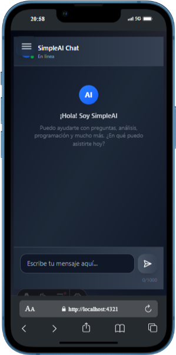
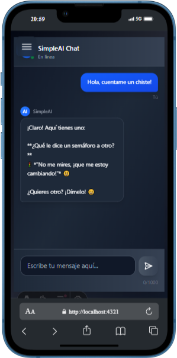
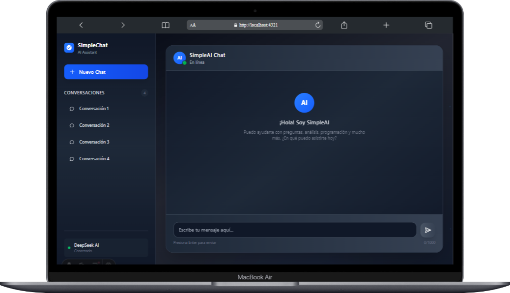
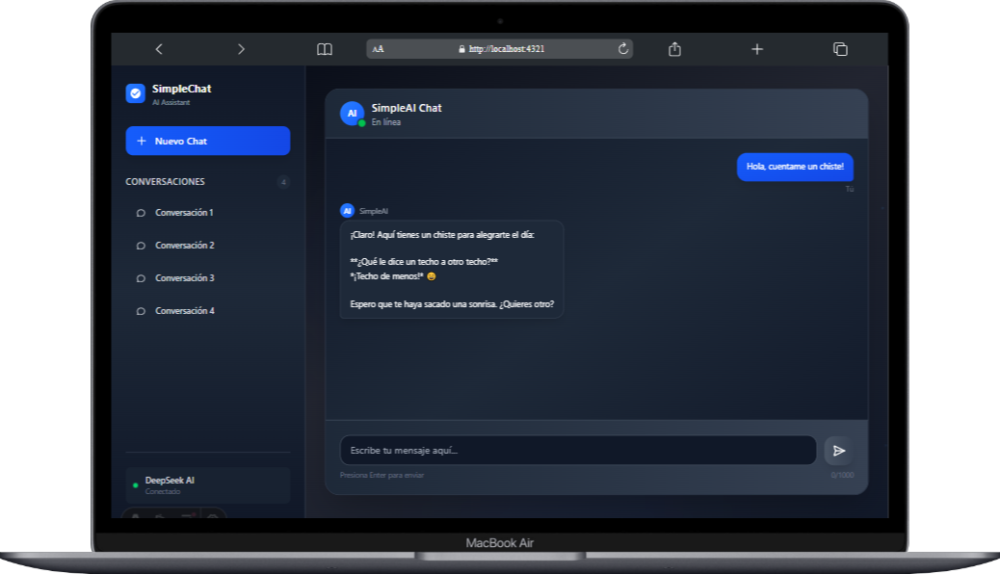

# SimpleAI Chat 🤖

Un chatbot de inteligencia artificial moderno y responsivo construido con Astro, React y TypeScript. Ofrece una experiencia de chat intuitiva con soporte para múltiples conversaciones y un diseño elegante que funciona perfectamente en dispositivos móviles y de escritorio.

## ✨ Características

- 💬 **Chat en tiempo real** con IA
- 📱 **Diseño completamente responsivo** (móvil y escritorio)
- 🗂️ **Múltiples conversaciones** con sidebar navegable
- 🎨 **Interfaz moderna** con animaciones suaves
- ⚡ **Construido con Astro** para máximo rendimiento
- � **TypeScript** para mayor robustez del código

## � Capturas de Pantalla

### Versión Móvil

<div align="center">
  
</div>

<div align="center">
  
  <p><em>Conversación activa en dispositivo móvil</em></p>
</div>

### Versión Escritorio

<div align="center">
  
 
</div>

<div align="center">
  
</div>

## 🚀 Estructura del Proyecto

El proyecto está estructurado de la siguiente manera:

```text
ai-chatbot/
├── public/
│   └── favicon.svg
├── src/
│   ├── components/          # Componentes React/Astro
│   │   ├── AnimatedBackground.tsx
│   │   ├── Background.astro
│   │   ├── ContainerChat.tsx
│   │   ├── Message.tsx
│   │   ├── SideBar.tsx
│   │   ├── TypingIndicator.tsx
│   │   └── Icons/           # Iconos SVG
│   ├── layouts/
│   │   └── BaseLayout.astro # Layout base de la aplicación
│   ├── pages/
│   │   ├── index.astro      # Página principal
│   │   ├── api/
│   │   │   └── chat.ts      # API endpoint para el chat
│   │   └── chat/
│   │       └── [id].astro   # Páginas dinámicas de chat
│   └── styles/
│       └── global.css       # Estilos globales
├── screenshots/             # Capturas de pantalla
├── astro.config.mjs        # Configuración de Astro
├── package.json
├── pnpm-lock.yaml
├── tsconfig.json
└── README.md
```

## 🛠️ Tecnologías Utilizadas

- **[Astro](https://astro.build/)** - Framework web moderno para sitios estáticos
- **[React](https://reactjs.org/)** - Biblioteca para interfaces de usuario
- **[TypeScript](https://www.typescriptlang.org/)** - JavaScript con tipado estático
- **CSS3** - Estilos modernos con variables CSS y flexbox/grid
- **[Tailwind CSS](https://tailwindcss.com/)** - Framework de utilidades para estilos rápidos y personalizables

## 🧞 Comandos

Todos los comandos se ejecutan desde la raíz del proyecto en una terminal:

| Comando                   | Acción                                           |
| :------------------------ | :----------------------------------------------- |
| `pnpm install`            | Instala las dependencias                        |
| `pnpm dev`                | Inicia el servidor de desarrollo en `localhost:4321` |
| `pnpm build`              | Construye la aplicación para producción en `./dist/` |
| `pnpm preview`            | Previsualiza la build localmente antes del deploy |
| `pnpm astro ...`          | Ejecuta comandos CLI como `astro add`, `astro check` |
| `pnpm astro -- --help`    | Obtiene ayuda usando la CLI de Astro            |

## 🚀 Instalación y Uso

1. **Clona el repositorio:**
   ```bash
   git clone [URL_DEL_REPOSITORIO]
   cd ai-chatbot
   ```

2. **Instala las dependencias:**
   ```bash
   pnpm install
   ```

3. **Inicia el servidor de desarrollo:**
   ```bash
   pnpm dev
   ```

4. **Abre tu navegador** y ve a `http://localhost:4321`

## 📁 Funcionalidades Principales

### � Sistema de Chat
- Interfaz de chat intuitiva con mensajes del usuario y respuestas de la IA
- Indicador de escritura mientras la IA procesa la respuesta
- Soporte para conversaciones largas con scroll automático

### 🗂️ Gestión de Conversaciones
- Sidebar con lista de conversaciones guardadas
- Posibilidad de crear nuevas conversaciones
- Navegación entre diferentes chats

### 📱 Diseño Responsivo
- Optimizado para dispositivos móviles y tablets
- Interfaz adaptativa que se ajusta al tamaño de pantalla
- Menús colapsables en dispositivos pequeños

## 🎨 Personalización

El proyecto utiliza variables CSS para facilitar la personalización de colores y estilos. Puedes modificar el archivo `src/styles/global.css` para ajustar la apariencia según tus preferencias.

## 📄 Licencia

Este proyecto está bajo la Licencia MIT. Consulta el archivo `LICENSE` para más detalles.

## 🤝 Contribuciones

Las contribuciones son bienvenidas. Por favor, abre un issue primero para discutir los cambios que te gustaría realizar.

## 📞 Contacto

Si tienes alguna pregunta o sugerencia, no dudes en abrir un issue en este repositorio.

---

<div align="center">
  <p>Hecho con ❤️ usando Astro y React</p>
</div>
